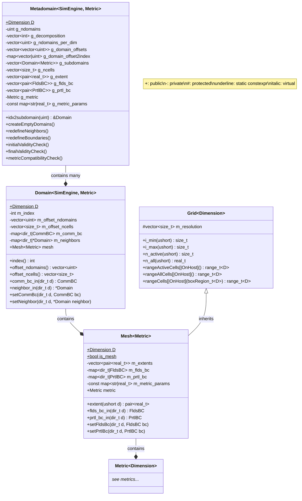

---
hide:
  - footer
---

# Domains and meshes

The main object which contains the information on global geometry of the domain including domain decomposition, the discretization, and the physical mesh is the `Metadomain<Metric<D>>` class.

*THIS SECTION IS UNDER CONSTRUCTION*

