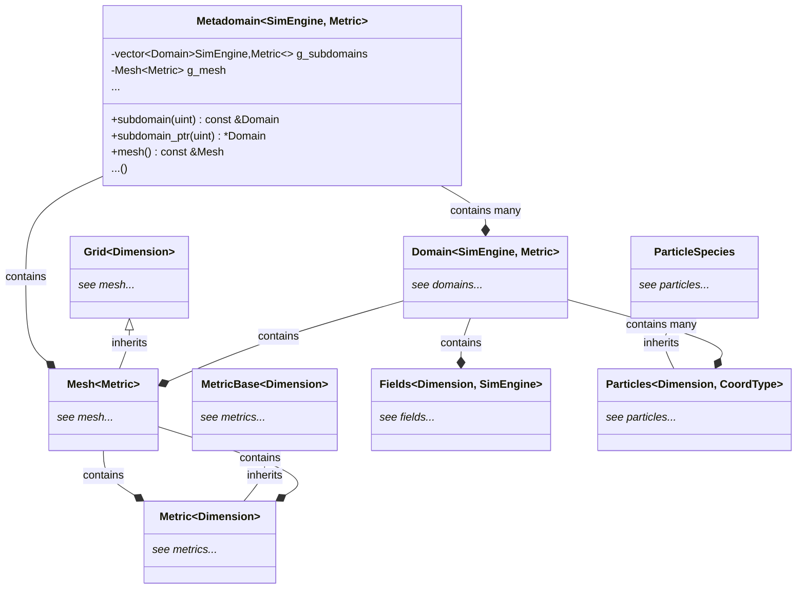

---
hide:
  - footer
---

# Hierarchy of structures

```mermaid
classDiagram
  direction TB
  class Metadomain~SimEngine, Metric~{
    -vector~Domain~SimEngine,Metric~~ g_subdomains
    -Mesh~Metric~ g_mesh
    ...
    +subdomain(uint) const &Domain
    +subdomain_ptr(uint) *Domain
    +mesh() const &Mesh
    ...()
  }
  class MetricBase~Dimension~{
    see metrics...*
  }
  class Metric~Dimension~{
    see metrics...*
  }
  class Mesh~Metric~{
    see mesh...*
  }
  class Domain~SimEngine, Metric~{
    see domains...*
  }
  class Fields~Dimension, SimEngine~{
    see fields...*
  }
  class Particles~Dimension, CoordType~{
    see particles...*
  }
  class ParticleSpecies {
    see particles...*
  }
  class Grid~Dimension~{
    see mesh...*
  }
  Domain --* Mesh : contains
  Grid <|-- Mesh : inherits
  Mesh --* Metric : contains
  Metadomain --* Domain : contains many
  Metadomain --* Mesh : contains
  Domain --* Fields : contains
  Domain --* Particles : contains many
  
  ParticleSpecies <|-- Particles : inherits
  MetricBase <|-- Metric : inherits
  Mesh --* Metric : contains
```