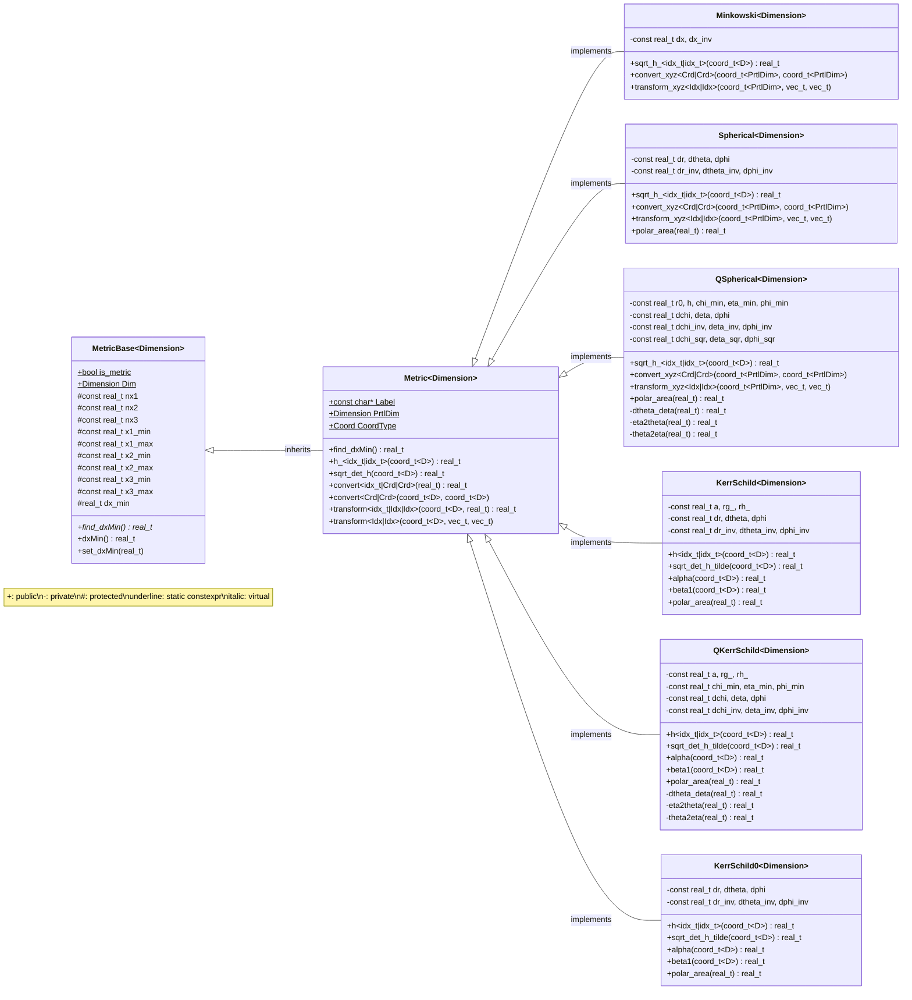

---
hide:
  - footer
---

# Metrics

Metrics are key objects of the Entity framework. Superimposed on the discretized mesh, they define the spacetime geometry of the simulation and provide necessary functions for converting coordinates and transforming vectors from one basis to another.

## Coordinate systems and bases

To understand how metrics are implemented in Entity, one must first understand the different coordinate systems and bases the Entity works with.

## Metric classes

Each metric has a number of distinct attributes. These are:

- `D`: the dimensionality of the metric:
    - `Dim::_1D`, `Dim::_2D`, `Dim::_3D`
- `Label`: a string that identifies the metric;
- `CoordType`: the type of coordinates used in the metric;
    - `Coord::Cart`, `Coord::Sph`, `Coord::Qsph`
- `PrtlDim`: the dimensionality of the particle coordinates. `PrtlDim == Dim::_3D` for SR spherical metrics, and `== D` otherwise; (1) 
    { .annotate }

    1.  :man_raising_hand: In 2D axisymmetric SR simulations, particles carry all three coordinates to recover their full Cartesian position, and transform fields to/from the global Cartesian basis.

## Methods

<table> 
  <tr>
    <th>method</th>
    <th>description</th>
    <th>arguments</th>
    <th>returns</th>
  </tr>
  <tr>
    <td><code>h_<i, j></code></td>
    <td>metric components $h_{ij}$</td>
    <td><code>coord_t&lt;D&gt; x_C</code></td>
    <td><code>real_t</code></td>
  </tr>
  <tr class="tr-gr2">
    <td><code>h<i, j></code></td>
    <td>metric components $h^{ij}$</td>
    <td><code>coord_t&lt;D&gt; x_C</code></td>
    <td><code>real_t</code></td>
  </tr>
  <tr class="tr-gr2">
    <td><code>alpha</code></td>
    <td>lapse function $\alpha$</td>
    <td><code>coord_t&lt;D&gt; x_C</code></td>
    <td><code>real_t</code></td>
  </tr>
  <tr class="tr-gr2">
    <td><code>beta1</code></td>
    <td>shift vector component $\beta^1$</td>
    <td><code>coord_t&lt;D&gt; x_C</code></td>
    <td></td>
  </tr>
  <tr>
    <td><code>sqrt_det_h</code></td>
    <td>$\sqrt{\det{h_{ij}}}$</td>
    <td><code>coord_t&lt;D&gt; x_C</code></td>
    <td><code>real_t</code></td>
  </tr>
  <tr class="tr-gr2">
    <td><code>sqrt_det_h_tilde</code></td>
    <td>$\sqrt{\det{h_{ij}}} / \sin{\theta}$</td>
    <td><code>coord_t&lt;D&gt; x_C</code></td>
    <td><code>real_t</code></td>
  </tr>
  <tr class="tr-gr1">
    <td><code>sqrt_h_<i, j></code></td>
    <td>$\sqrt{h_{ij}}$</td>
    <td><code>coord_t&lt;D&gt; x_C</code></td>
    <td><code>real_t</code></td>
  </tr>
  <tr class="tr-gr3">
    <td><code>polar_area</code></td>
    <td>$A_{\theta\phi}$</td>
    <td><code>real_t x1_C</code></td>
    <td><code>real_t</code></td>
  </tr>
  <tr>
    <td><code>convert<i, in, out></code></td>
    <td>converts the $i$-th component of a coordinate to another basis</td>
    <td><code>real_t</code></td>
    <td><code>real_t</code></td>
  </tr>
  <tr>
    <td><code>convert<in, out></code></td>
    <td>converts the full $D$-dimensional coordinate to another basis</td>
    <td><code>coord_t&lt;D&gt;, &coord_t&lt;D&gt;</code></td>
    <td></td>
  </tr>
  <tr class="tr-gr1">
    <td><code>convert_xyz<in, out></code></td>
    <td>explicitly converts to/from a Cartesian basis</td>
    <td><code>coord_t&lt;PrtlDim&gt;, &coord_t&lt;PrtlDim&gt;</code></td>
    <td></td>
  </tr>
  <tr>
    <td><code>transform<i, in, out></code></td>
    <td>transforms the $i$-th component of a vector to another frame</td>
    <td><code>coord_t&lt;D&gt; x_C, real_t</code></td>
    <td><code>real_t</code></td>
  </tr>
  <tr>
    <td><code>transform<in, out></code></td>
    <td>transforms the full $3D$ vector to another frame</td>
    <td><code>coord_t&lt;D&gt;, vec_t<3D>, &vec_t<3D></code></td>
    <td></td>
  </tr>
  <tr class="tr-gr1">
    <td><code>transform_xyz<in, out></code></td>
    <td>explicitly transforms to/from a Cartesian frame</td>
    <td><code>coord_t&lt;PrtlDim&gt;, vec_t<3D>, &vec_t<3D></code></td>
    <td></td>
  </tr>
</table>

<span tr-gr1></span> = only defined for SR metrics

<span tr-gr2></span> = only defined for GR metrics

<span tr-gr3></span> = only defined for spherical metrics

The `in` and `out` template arguments for the `convert<>` and `transform<>` functions are, respectively, the coordinate bases (stored as an enum `Crd::`) and the vector reference frame (stored as enum `Idx::`). The members of these enums are:

<table>
  <tr>
    <th></th>
    <th>description</th>
  </tr>
  <tr>
    <td><code>Crd::Cd</code></td>
    <td>code-unit coordinates: $x^i$</td>
  </tr>
  <tr class="tr-gr1">
    <td><code>Crd::XYZ</code></td>
    <td>cartesian coordinates: $x^{x}$</td>
  </tr>
  <tr>
    <td><code>Crd::Sph</code></td>
    <td>spherical coordinates: $x^{r}$</td>
  </tr>
  <tr>
    <td><code>Crd::Ph</code></td>
    <td>"physical" coordinates: $x^{I}$</td>
  </tr>
</table>


!!! note "`Crd::Ph`"
    Depending on the metric, `Crd::Ph` is equivalent to `Crd::XYZ` or `Crd::Sph`. 

<table>
  <tr>
    <th></th>
    <th>description</th>
  </tr>
  <tr>
    <td><code>Idx::U</code></td>
    <td>upper (contravariant) basis (code units): $u^i$</td>
  </tr>
  <tr>
    <td><code>Idx::D</code></td>
    <td>lower (covariant) basis (code units): $u_i$</td>
  </tr>
  <tr>
    <td><code>Idx::T</code></td>
    <td>tetrad (orthonormal) basis $u^{\hat{i}} \equiv u_{\hat{i}} \equiv u^{\hat{I}} \equiv u_{\hat{I}}$</td>
  </tr>
  <tr class="tr-gr1">
    <td><code>Idx::XYZ</code></td>
    <td>global Cartesian basis: $u^{\hat{x}}\equiv u_{\hat{x}}$</td>
  </tr>
  <tr class="tr-gr1">
    <td><code>Idx::Sph</code></td>
    <td>global spherical basis: $u^{\hat{r}}\equiv u_{\hat{r}}$</td>
  </tr>
  <tr>
    <td><code>Idx::PU</code></td>
    <td>physical contravariant basis: $u^I$</td>
  </tr>
  <tr>
    <td><code>Idx::PD</code></td>
    <td>physical covariant basis: $u_I$</td>
  </tr>
</table>

<span tr-gr1></span> = only possible in SR

!!! note

    For Cartesian metric, transforming to `Idx::T` is equivalent to converting to `Idx::XYZ`, and similarly for the spherical metric, transforming to `Idx::T` is equivalent to converting to `Idx::Sph`.

!!! example

    Metric component $1,1$ in the covariant basis, $h_{11}$, can be accessed via in the certain position `x_Code` in code units by calling (assuming `D` is the dimension of the metric): 
    ```c++
    coord_t<D> x_Code;
    // define x_Code
    metric.template h_<1, 1>(x_Code)
    ```
    To convert `x_Code` to physical coordinates:
    ```c++
    coord_t<D> x_Ph { ZERO }; // init with zero so the compiler doesn't complain
    metric.template convert<Crd::Cd, Crd::Ph>(x_Code, x_Ph);
    ```
    To transform a vector `v_Cov` from the covariant basis to the tetrad basis:
    ```c++
    vec_t<Dim::_3D> v_Cov;
    // define v_Cov
    vec_t<Dim::_3D> v_T { ZERO };
    metric.template transform<Idx::D, Idx::T>(x_Code, v_Cov, v_T);
    ```
    For SR metrics you can also explicitly convert coordinates and transform vectors to/from the cartesian basis:
    ```c++
    coord_t<PrtlDim> x_Code;
    // define x_Code (notice, that for 2D spherical metrics this will be 3D)
    metric.template convert_xyz<Crd::Cd, Crd::XYZ>(x_Code, x_Cart);

    vec_t<Dim::_3D> v_Cntrv;
    // define v_Cntrv
    vec_t<Dim::_3D> v_XYZ { ZERO };
    metric.template transform_xyz<Crd::Cd, Crd::XYZ>(x_Code, v_Cntrv, v_XYZ);
    ```

## Metric structure and hierarchy

Below is a diagram that demonstrates the structure of the metric classes and their inheritance hierarchy.


