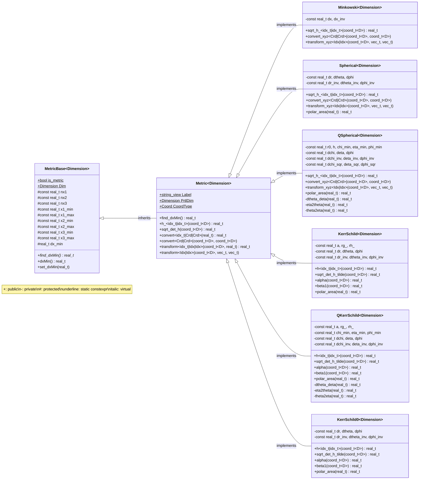

---
hide:
  - footer
---

# Metrics

Metrics are key objects of the Entity framework. Superimposed on the discretized mesh, they define the spacetime geometry of the simulation and provide necessary functions for converting coordinates and transforming vectors from one basis to another.

Each metric has a number of distinct attributes. These are:

- `D`: the dimensionality of the metric:
    - `Dim::_1D`, `Dim::_2D`, `Dim::_3D`
- `Label`: a string that identifies the metric;
- `CoordType`: the type of coordinates used in the metric;
    - `Coord::Cart`, `Coord::Sph`, `Coord::Qsph`
- `PrtlDim`: the dimensionality of the particle coordinates (1) 
    { .annotate }

    1.  :man_raising_hand: In 2D axisymmetric SR simulations, particles carry all three coordinates to recover their full Cartesian position, and transform fields to/from the global Cartesian basis.

  <!-- namespace SRMetrics {
    class Minkowski~Dimension~ {
      -const real_t dx, dx_sqr, dx_inv
    }
    class Spherical~Dimension~ {
      
      
      
      +h_~idx_t|idx_t~(coord_t~D~) real_t
      +sqrt_h_~idx_t|idx_t~(coord_t~D~) real_t
      +sqrt_det_h(coord_t~D~) real_t
      +convert~idx_t|Crd|Crd~(real_t) real_t
      +convert~Crd|Crd~(coord_t~D~, coord_t~D~)
      
      +transform~idx_t|Idx|Idx~(coord_t~D~, real_t) real_t
      +transform~Idx|Idx~(coord_t~D~, vec_t, vec_t)
      
    }
  } -->

[^1]: Some say yes