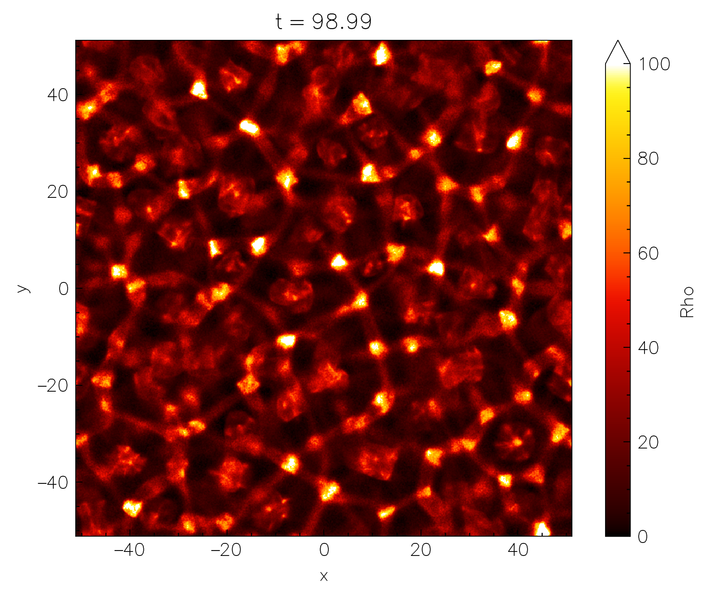
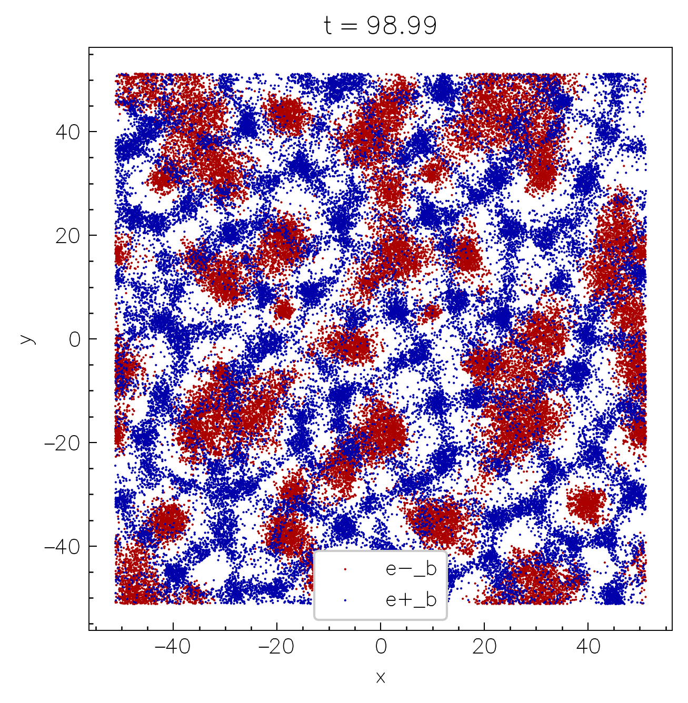
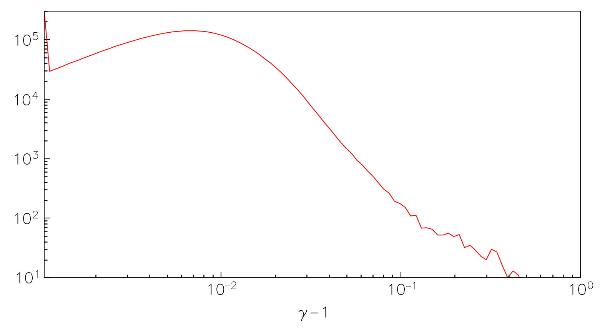

---
hide:
  - footer
---

# Output & visualization

To enable the runtime output of the simulation data, configure the code with the `-D output=ON` flag. As a backend `Entity` uses the open-source [ADIOS2](https://github.com/ornladios/ADIOS2) library compiled in-place. The output is written in the `ADIOS2` format called `BP5`, but [HDF5](https://adios2.readthedocs.io/en/latest/engines/engines.html#hdf5) is also available (but not recommended). 

The output is configured using the following configurations in the `input` file:

```toml
[simulation]
  name   = "MySimulation" # (5)!

  # ...
[[particles.species]]
  tracking = true # (16)!

  # ...
[output]
  format = "BPFile" # (2)!
  interval = 100 # (3)!
  interval_time = 0.1 # (8)!
  separate_files = true # (15)!

  [output.fields]
    quantities = ["B", "E", "Rho_1_2", "..."] # (1)!
    stride = 2 # (9)!
    mom_smooth = 2 # (4)!

  [output.particles]
    species = [1, 2, 4] # (7)!
    stride = 10 # (6)!

  [output.spectra]
    e_min = 1e-2 # (12)!
    e_max = 1e3
    log_bins = true # (13)!

  [output.stats]
    quantities = ["N", "Npart", "ExB", "J.E"] # (14)!

  [output.debug]
    as_is = false # (10)!
    ghosts = false # (11)!
```

1. fields to write
2. output format (current supported: "BPFile"/"HDF5", or "disabled" for no output)
3. output interval (in the number of time steps)
4. smoothing stencil size for moments (in the number of cells) [defaults to 1]
5. title is used for the output filename
6. stride used for particle output (write every `prtl_stride`-th particle) [defaults to 100]
7. particle species to output
8. output interval in time units (overrides `interval` if specified)
9. stride used for field output (write every `fields_stride`-th cell) [defaults to 1]
10. write the field quantities as-is (without conversion/interpolation) [defaults to false]
11. write the ghost cells [defaults to false]
12. Min/max energies for binning the energy distribution [default to 1e-3 -> 1e3]
13. whether to use logarithmic energy bins or linear
14. box reduced quantities to output as stats
15. whether to write in a single file or into separate files
16. enable tracking for a given particle species

Following is the list of all supported fields

| Field name | Description                              | Normalization  |
| ---------- | ---------------------------------------- | -------------- |
| `E`        | Electric field (all components)          | $B_0$          |
| `B`        | Magnetic field (all components)          | $B_0$          |
| `D`        | GR: electric field (all components)      | $B_0$          |
| `H`        | GR: aux. magnetic field (all components) | $B_0$          |
| `J`        | Current density (all components)         | $4\pi q_0 n_0$ |
| `Rho`      | Mass density                             | $m_0 n_0$      |
| `Charge`   | Charge density                           | $q_0 n_0$      |
| `N`        | Number density                           | $n_0$          |
| `V`        &nbsp;<a href="https://github.com/entity-toolkit/entity/pull/69"> <span class="since-version">1.2.0</span> </a> | Mean 3-velocity                          | dimensionless |
| `Nppc`     | Raw number of particles per cell         | dimensionless  |
| `Tij`      | Energy-momentum tensor (all components)  | $m_0 n_0$      |
| `divE`    &nbsp;<a href="https://github.com/entity-toolkit/entity/pull/69"> <span class="since-version">1.2.0</span> </a> | Divergence of $E$                        | arb. units     |
| `divD`   &nbsp;<a href="https://github.com/entity-toolkit/entity/pull/69"> <span class="since-version">1.2.0</span> </a>  | GR: divergence of $D$                    | arb. units     |
| `A`        | GR: 2D vector potential $A_\varphi$      | arb. units     |

and particle quantities

| Particle quantity | Description                                               | Units         |
| ----------------- | --------------------------------------------------------- | ------------- |
| `X`               | Coordinates (all components)                              | physical      |
| `U`               | Four-velocities (all components)                          | dimensionless |
| `W`               | Weights                                                   | dimensionless |
| `PLDR` &nbsp;<a href="https://github.com/entity-toolkit/entity/pull/144"> <span class="since-version">1.3.0</span> </a>           | Real-valued payloads                                      | arbitrary     |
| `PLDI` &nbsp;<a href="https://github.com/entity-toolkit/entity/pull/144"> <span class="since-version">1.3.0</span> </a>           | Integer-valued payloads                                   | arbitrary     |
| `RNK` &nbsp;<a href="https://github.com/entity-toolkit/entity/pull/144"> <span class="since-version">1.3.0</span> </a>            | Meshblock rank the particle was created (if MPI is ON)    | --            |
| `IDX` &nbsp;<a href="https://github.com/entity-toolkit/entity/pull/144"> <span class="since-version">1.3.0</span> </a>            | Index of the particle on the given rank                   | --            |

<a href="https://github.com/entity-toolkit/entity/pull/69"> <span class="since-version">1.2.0</span> </a> The code also has an output of box-averaged stats into a `.csv` file, which are simply scalars per each output timestep. The following quantities can be computed

| Box-reduced quantity   | Description                                               | Units              |
| ---------------------- | --------------------------------------------------------- | ------------------ |
| `E^2`                  | Mean $E^2$                                                | $B_0^2$            |
| `B^2`                  | Mean $B^2$                                                | $B_0^2$            |
| `ExB`                  | Mean $\bm{E}\times \bm{B}$                                | $B_0^2$            |
| `J.E`                  | Mean $\bm{J}\cdot \bm{E}$                                 | $4\pi q_0 n_0 B_0$ |
| `N`                    | Mean $n$                                                  | $n_0$              |
| `Npart`                | Total # of particles                                      | dimensionless      |
| `Rho`                  | Mean mass density                                         | $m_0 n_0$          |
| `Charge`               | Mean charge density                                       | $q_0 n_0$          |
| `Tij`                  | Mean energy-momentum tensor (all components)              | $m_0 n_0$          |

"Mean" in this context refers to volume-averaging: i.e., $\langle E_x^2 \rangle = V^{-1}\int \sqrt{h} d^3 \bm{x}~ E_x^2 $, or $\langle T^{ij}\rangle \equiv V^{-1} \int d^3\bm{u} \sqrt{h} d^3 \bm{x} ~(u^i u^j / u^0) f(\bm{u}) $, where $V\equiv \int \sqrt{h} d^3\bm{x}$. As such, these values (except for `Npart`) are insensitive to the resolution of the grid or the number of particles per cell.

!!! note "Refining moments for the output"

    One can specify particular components to output for the `Tij` fields/stats: `T0i` will output the `T00`, `T01`, and `T02` components, while `Tii` will output only the diagonal components: `T11`, `T22`, and `T33`, and `Tij` will output all the 6 components. For quantities computed from particles (moments of the distribution), one can also specify the particle species which will be used to compute the moments: `Rho_1` (density of species 1), `N_2_3` (number density of species 2 and 3), `Tij_1_3` (energy-momentum tensor for species 1 and 3), etc. 

All of the vector fields are interpolated to cell centers before the output, and converted to orthonormal basis. The particle-based moments are smoothed with a stencil (specified in the input file; `mom_smooth`) for each particle.

In addition, one can write custom user-defined field quantities to the output with the fields or stats. Refer to [the following section](../2-howto/1-problem_generators.md#custom-field-output) for more details.

!!! success "Can one track particles at different times?"

    <span class="since-version">1.3.0</span> Yes! Simply enable particle tracking for a particular species. Then each particle is uniquely identified by a combination of `IDX` and `RNK` (if no MPI is used, then only `IDX` is sufficient). `nt2py` already automatically combines the variables producing a unique `id` for each particle (for the species where tracking is enabled). However, keep in mind, that the simulations are not reproducible and will unfortunately never be due to limitations imposed by the nature of GPU computations. 


## [`nt2py`](https://pypi.org/project/nt2py/)

We provide the `nt2py` python package to help easily access and manipulate the simulation data. `nt2py` package uses the [`dask`](https://docs.dask.org/en/stable/) and [`xarray`](https://docs.xarray.dev/en/stable/) libraries together with [`adios2`](https://pypi.org/project/adios2/) and/or [`h5py`](https://pypi.org/project/h5py/) to [lazily load](https://en.wikipedia.org/wiki/Lazy_loading) the output data and provide a convenient interface for the data analysis and quick visualization. 

To start using `nt2py`, it is recommended to create a python virtual environment and install the required packages:

```shell
python3 -m venv .venv
source .venv/bin/activate # (1)!
pip install nt2py # (2)!
```

1. Now all the packages will be installed in the `.venv` directory which you can remove at any time without affecting the system.
2. If you plan to use jupyter you might also need to run the following `pip install jupyterlab ipykernel`.

Now simply import the `nt2` module and load the output data:

```python
import nt2

data = nt2.Data("MySimulation")
```

1. Note, that even though the `h5` file can be quite large, the data is loaded lazily, so the memory consumption is minimal; data chunks are only loaded when they are actually needed for the analysis or visualization.

### Accessing fields

Data selection is conveniently done with the `sel` and `isel` methods for the `xarray` Datasets ([more info](https://docs.xarray.dev/en/stable/user-guide/indexing.html)). For example, to select the `Rho` field around physical time `t=98`, one can do:

```python
data.fields.Rho.sel(t=98, method="nearest") # (1)!
```

1. The `method="nearest"` is used to select the closest time step to the requested time.

{width=50%, align=right} 

We can then plot the selected data using the `plot` method of the `xarray` Dataset:

```python
data.fields.Rho\
  .sel(t=98, method="nearest")\
  .plot(
    norm=mpl.colors.Normalize(0, 1e2),  # (2)!
    cmap="jet") # (1)!
```

1. The `norm` and `cmap` arguments are used to set the colorbar limits and the colormap just like in normal `matplotlib` context.
2. Make sure to also `module load matplotlib as mpl`.

If the resolution is too high, one can also coarsen the data before plotting:

```python
data.fields.Rho\
  .sel(t=98, method="nearest")\
  .coarsen(x=16, y=4).mean()\
  .plot(
    norm=mpl.colors.Normalize(0, 1e2),
    cmap="jet")
```

or downsample:

```python
data.fields.Rho\
  .sel(t=98, method="nearest")\
  .isel(x=slice(None, None, 16), y=slice(None, None, 4))\ # (1)!
  .plot(
    norm=mpl.colors.Normalize(0, 1e2),
    cmap="jet")
```

1. The difference between `isel` and `sel` is that `isel` uses the integer indices along the given dimension, while `sel` uses the physical coordinates.

{width=50%, align=right} 

One can also do more complicated things, such as building a 1D plot of the evolution of the mean $B^2$ in the box:

```python
data.fields.Bx**2 + data.fields.By**2 + data.fields.Bz**2\
  .mean(("x", "y"))\
  .plot()
```

or make "waterfall" plots, collapsing the quantity along one of the axis, and plotting vs the other axis and time:

```python
(data.fields.Rho_2 - data.fields.Rho_1)\
  .mean("x")\
  .plot(yincrease=False)
```

Particles and spectra can, in turn, be accessed via `data.particles[s]`, where `s` is the species index, and `data.spectra`.


!!! code "`nt2py` documentation"

    You can access the documentation of the `nt2py` functions and methods of the `Data` object by calling `nt2.<function>?` in the jupyter notebook or `help(nt2.<function>)` in the python console.

### Accessing particles

Particles are stored in the same `data` object and are lazily preloaded when one calls `nt2.Data(...)`, as we did above. To access the particle data, use `data.particles`, which returns a custom object which can then be converted into an explicitly populated dataframe using the `load()` method. Selection of particles can be done in a similar way to the fields:

```python
data.particles.sel(t=slice(None, 10)).sel(sp=[1, 3], id=[123, 456, 789]).load()
```

which selects all times before $t<10$, selects species 1 and 3, and picks specific particle id-s (traced along all preselected times). There are two built-in plotting methods: `.spectrum_plot`, and `.phase_plot`, for plotting a 1D energy distribution function of each species, and a 2D phase-space plot (or any 2D binned plot). 

```python
data.particles.sel(t=10).spectrum_plot(
    bins=np.logspace(0, 3), 
    quantity=lambda df: np.sqrt(1 + df.ux**2 + df.uy**2 + df.uz**2),
)

data.particles.sel(t=10).phase_plot(
    x_quantity=lambda df: df.x,
    y_quantity=lambda df: df.ux,
    xy_bins=(np.linspace(-1, 1), np.linspace(0, 2)),
)
```

You may, however, simply use the data from the dataframe to make the plots directly:

```python
df = data.particles.sel(t=10, method="nearest").load()
plt.scatter(df.x, df.y, colors=df.sp) # color by species
```

??? showplot "scatter plot $\{x,~y\}$"

    

!!! code "`isel` indexing"

    `isel(t=-1)` selects the last time step.

### Accessing runtime spectra

Distribution functions for all particle species in the box are also written with the data at specified timesteps. These can be accessed via `data.spectra`, which has several different fields. As in particles & fields, you can access the data at different times using `data.spectra.isel(t=...)` or `data.spectra.sel(t=...)`. The energy bins are written into `data.spectra.e`; by default, the binning is done logarithmically in $\gamma - 1$ for massive particles and energy, $E$, for the photons. Below is an example script to build a distribution function of electron-positron pairs at output step `t=450`:

```python
sp = data.spectra.isel(t=450)

plt.figure(figsize=(6, 3))
plt.xscale("log")
plt.yscale("log")
plt.plot(sp.e, sp.n_1 + sp.n_2, c="r")
plt.ylim(10, 3e5)
plt.xlabel(r"$\gamma - 1$")
plt.xlim(sp.e.min(), 1)
```

???+ showplot "particle spectra"

    

---

### Exporting movies

To produce animations, `nt2py` provides a shortcut helper function which saves the frames using multiple threads, and then calls `ffmpeg` to merge them into a video file. 

```python
def plot_frame(ti, data):
    # function must take two parameters:
    # - ti: output index
    # - data: the dataset loaded with nt2.read
    #
    # any type data manipulation & plotting routine goes here
    # e.g.
    fig = plt.figure()
    ax = fig.add_subplot(111)
    (data.fields.N_1 + data.fields.N_2).isel(t=ti).plot(ax=ax, cmap="viridis")
    #                                        ^
    #                           selecting timestep by index

# then simply pass this function to the routine:
data.makeMovie(plot_frame, num_cpus=8, framerate="10", ...)
#                                   ^
#                 (optional) by default all available threads are used
```

`makeMovie` also accepts a number of arguments used by `ffmpeg`, such as the framerate, the compression rate, etc. Run the following to see all the arguments:

```python
import nt2.export as nt2e
nt2e.makeMovie?
```
