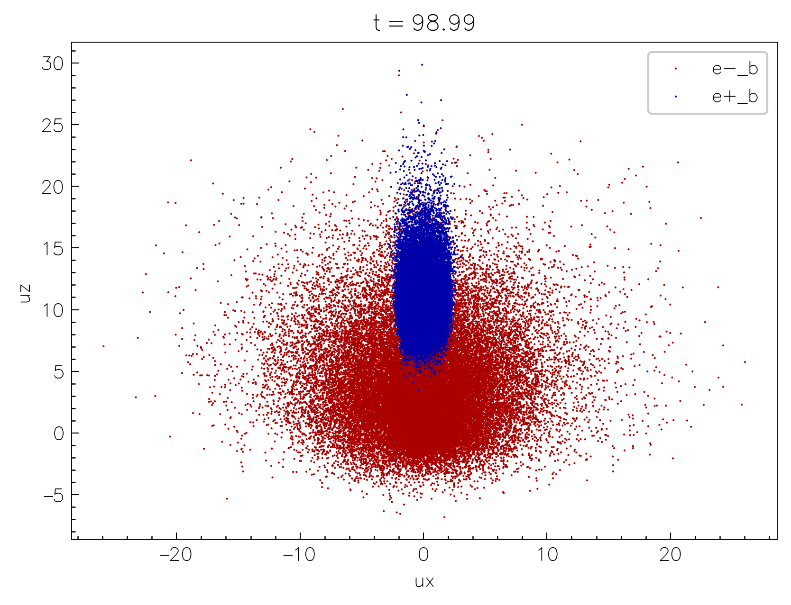

---
hide:
  - footer
---

# Output & visualization

To enable the runtime output of the simulation data, configure the code with the `-D output=ON` flag. As a backend `Entity` uses the open-source [ADIOS2](https://github.com/ornladios/ADIOS2) library compiled in-place. The output is written in the [HDF5](https://adios2.readthedocs.io/en/latest/engines/engines.html#hdf5) format, however, more formats will be added in the future. 

The output is configured using the following configurations in the `input` file:

```toml
[simulation]
title   = "MySimulation" # (5)!

# ...

[output]
format          = "HDF5" # (2)!
fields          = ["B", "E", "Rho_1_2", ...] # (1)!
particles       = ["X_1_2", "U_3_4", "W"] # (7)!
interval        = 100 # (3)!
interval_time   = 0.1 # (8)!
mom_smooth      = 2 # (4)!
fields_stride   = 2 # (9)!
prtl_stride     = 10 # (6)!
as_is           = false # (10)!
ghosts          = false # (11)!
```

1. fields to write
2. output format (current supported: "HDF5", or "disabled" for no output)
3. output interval (in the number of time steps)
4. smoothing stencil size for moments (in the number of cells) [defaults to 1]
5. title is used for the output filename
6. stride used for particle output (write every `prtl_stride`-th particle) [defaults to 100]
7. particle quantities to write
8. output interval in time units (overrides `interval` if specified)
9. stride used for field output (write every `fields_stride`-th cell) [defaults to 1]
10. write the field quantities as-is (without conversion/interpolation) [defaults to false]
11. write the ghost cells [defaults to false]

Output is written in the run directory in a single `hdf5` file: `MySimulation.h5`. All the steps are written in the same file, and the time step is stored as an attribute of the dataset: `Step0`, `Step1`, `Step2`, etc. Thus to access, say, the `Ez` field at the 10th output step (not the same as the simulation timestep), one has to access the dataset `/Step9/Ez` in the `hdf5` file. If one needs the `X1` coordinates of particles of species 2 at the 5th output step, one has to access the dataset `/Step4/X1_2` in the `hdf5` file, etc.

Following is the list of the supported fields

| Field name  | Description                       | Normalization         |
|---          |---                                |---                    |
| `E`         | Electric field (all components)   | $B_0$                 |
| `B`         | Magnetic field (all components)   | $B_0$                 |
| `D`         | GR: electric field (all components)   | $B_0$                 |
| `H`         | GR: aux. magnetic field (all components)   | $B_0$                 |
| `J`         | Current density (all components)  | $4\pi q_0 n_0$        |
| `Rho`       | Mass density                      | $m_0 n_0$             |
| `Charge`    | Charge density                    | $q_0 n_0$             |
| `N`         | Number density                    | $n_0$                 |
| `Nppc`      | Raw number of particles per cell  | dimensionless         |
| `Nppc`      | Raw number of particles per cell  | dimensionless         |
| `Tij`       | Energy-momentum tensor (all components) | $m_0 n_0$       |
| `divE`      | Divergence of $E$  | arb. units         |
| `divD`      | GR: divergence of $D$  | arb. units         |
| `A`         | GR: 2D vector potential $A_\varphi$  | arb. units         |

and particle quantities

| Particle quantity | Description | Units |
|-------------------|-------------|-------|
| `X` | Coordinates (all components) | physical |
| `U` | Four-velocities in the orthonormal frame (all components) | dimensionless |
| `W` | Weights | dimensionless |

!!! note "Refining fields and particle quantities for the output"

    One can specify particular components to output for the `Tij` fields: `T0i` will output the `T00`, `T01`, and `T02` components, while `Tii` will output only the diagonal components: `T11`, `T22`, and `T33`. One can also specify the particle species which will be used to compute the moments or output particle quantities: `Rho_1` (density of species 1), `N_2_3` (number density of species 2 and 3), `Tij_1_3` (energy-momentum tensor for species 1 and 3), etc. Or for the particle quantities: `X_1_2` will write the coordinates of particles of species 1 and 2 only. If no species are specified, the moments will be computed for all the species with $m_s \ne 0$.

All of the vector fields are interpolated to cell centers before the output, and converted to orthonormal basis. The particle-based moments are smoothed with a stencil (specified in the input file; `mom_smooth`) for each particle.

!!! failure "Can one track particles at different times?"

    Particle tracking (outputting the same batch of particles at every timestep) is unfortunately not yet implemented, and will unlikely be available due to limitations imposed by the nature of GPU computations.

## `nt2.py`

To make the life easier, the `nt2.py` script is provided with the `Entity` source code in the `vis/` directory (the requirements are also provided in the `vis/requirements.txt`). `nt2.py` uses the [`dask`](https://docs.dask.org/en/stable/) and [`xarray`](https://docs.xarray.dev/en/stable/) libraries together with [`h5py`](https://pypi.org/project/h5py/) and [`h5pickle`](https://github.com/DaanVanVugt/h5pickle) to [lazily load](https://en.wikipedia.org/wiki/Lazy_loading) the output data and provide a convenient interface for the data analysis and quick visualization. 

To start using `nt2.py`, it is recommended to create a python virtual environment and install the required packages:

```shell
python3 -m venv .venv
source .venv/bin/activate # (1)!
pip install -r vis/requirements.txt # (2)!
```

1. Now all the packages will be installed in the `.venv` directory which you can remove at any time without affecting the system.
2. If you plan to use jupyter you might also need to run the following `pip install jupyterlab ipykernel`.

Now simply import the `nt2` module and load the output data:

```python
import nt2 # (1)!
data = nt2.Data("MySimulation.h5")
```

1. If working outside the `vis/` directory you might need to add the `vis/` to your path: `import sys; sys.path.append("vis")` in order to import `nt2`.

Note, that even though the `h5` file can be quite large, the data is loaded lazily, so the memory consumption is minimal; data chunks are only loaded when they are actually needed for the analysis or visualization.

### Accessing fields

Data selection is conveniently done with the `sel` and `isel` methods for the `xarray` Datasets ([more info](https://docs.xarray.dev/en/stable/user-guide/indexing.html)). For example, to select the `Rho` field around physical time `t=98`, one can do:

```python
data.Rho.sel(t=98, method="nearest") # (1)!
```

1. The `method="nearest"` is used to select the closest time step to the requested time.

{width=50%, align=right} 

We can then plot the selected data using the `plot` method of the `xarray` Dataset:

```python
data.Rho\
  .sel(t=98, method="nearest")\
  .plot(
    norm=mpl.colors.Normalize(0, 1e2),  # (2)!
    cmap="jet") # (1)!
```

1. The `norm` and `cmap` arguments are used to set the colorbar limits and the colormap just like in normal `matplotlib` context.
2. Make sure to also `module load matplotlib as mpl`.

If the resolution is too high, one can also coarsen the data before plotting:

```python
data.Rho\
  .sel(t=98, method="nearest")\
  .coarsen(x=16, y=4).mean()\
  .plot(
    norm=mpl.colors.Normalize(0, 1e2),
    cmap="jet")
```

or downsample:

```python
data.Rho\
  .sel(t=98, method="nearest")\
  .isel(x=slice(None, None, 16), y=slice(None, None, 4))\ # (1)!
  .plot(
    norm=mpl.colors.Normalize(0, 1e2),
    cmap="jet")
```

1. The difference between `isel` and `sel` is that `isel` uses the integer indices along the given dimension, while `sel` uses the physical coordinates.

{width=50%, align=right} 

One can also do more complicated things, such as building a 1D plot of the evolution of the mean $B^2$ in the box:

```python
data.Bx**2 + data.By**2 + data.Bz**2\
  .mean(dim=["x", "y"])\
  .plot()
```

or make "waterfall" plots, collapsing the quantity along one of the axis, and plotting vs the other axis and time:

```python
(data.Rho_2 - data.Rho_1)\
  .mean(dim="x")\
  .plot(yincrease=False)
```

### Accessing particles

Particles are stored in the same `data` object and are lazily preloaded when one calls `nt2.Data(...)`, as we did above. To access the particle data, use `data.particles`, which returns a python dictionary where the key is particles species index, and the value is an `xarray` Dataset with the particle data. For example, to access the `x` and `y` coordinates of the first species, one can do:

```python
data.particles[1].x
data.particles[1].y
```

The shape of the returned dataset is number of particles times the number of time steps. To select the data at a specific time step, one can use the same `sel` or `isel` methods mentioned above. For example, to access the 10-th output timestep of the 3-rd species, one can do:

```python
data.particles[3].isel(t=10).x
```

{width=50%, align=right} 

Scatter plotting the particles on a 2D plane is quite easy, since `xarray` has a built-in `plot.scatter` method:

```python
species_3 = data.particles[3]
species_4 = data.particles[4]

species_3.isel(t=-1)\
  .plot.scatter(x="x", y="y", 
                label=species_3.attrs["label"])
species_4.isel(t=-1)\
  .plot.scatter(x="x", y="y", 
                label=species_4.attrs["label"])
```

!!! note "`isel` indexing"

    `isel(t=-1)` selects the last time step.

{width=50%, align=right} 

Or one can plot the same in phase space:

```python
species_3.isel(t=-1)\
  .plot.scatter(x="ux", y="uy", 
                label=species_3.attrs["label"])
species_4.isel(t=-1)\
  .plot.scatter(x="ux", y="uy", 
                label=species_4.attrs["label"])
```


!!! note "`nt2` documentation"

    You can access the documentation of the `nt2` functions and methods of the `Data` object by calling `nt2.<function>?` in the jupyter notebook or `help(nt2.<function>)` in the python console.